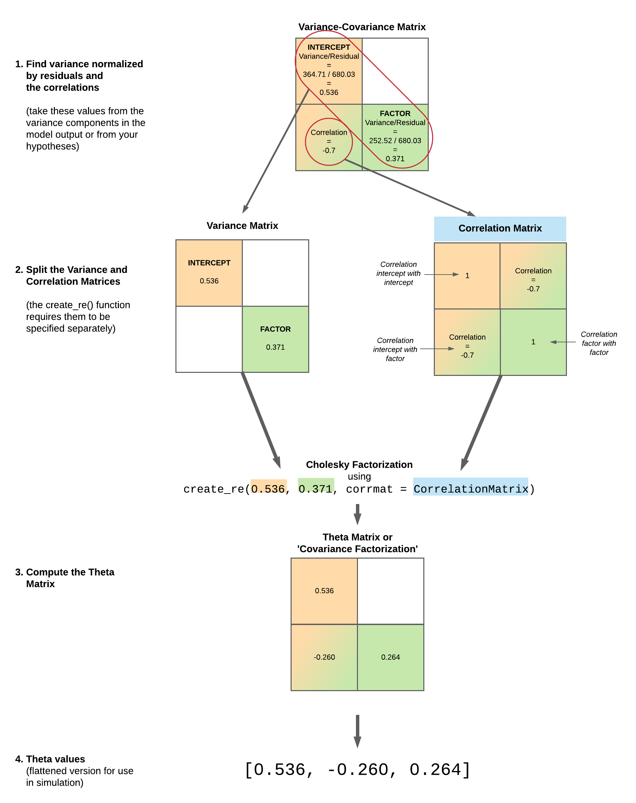

# Power Analysis and Simulation Tutorial

*contributed by Lisa Schwetlick and Daniel Backhaus*

This tutorial demonstrates how to conduct power analyses and data simulation using Julia and the MixedModelsSim package.

Power analysis is an important tool for planning an experimental design. Here we show how to:

1. Use existing data as a basis for power calculations by simulating new data.
2. Adapt parameters in a given linear mixed model to analyze power without changing the existing data set.
3. Create a (simple) balanced fully crossed dataset from scratch and analyze power.
4. Recreate a more complex dataset from scratch and analyze power for specific model parameter but various sample sizes.

## Setup

### Load the packages we'll be using in Julia

First, here are the packages needed in this example.

```@setup Main
using DisplayAs # so that things look REPL-y
```

```@example Main
using MixedModels        # run mixed models
using MixedModelsSim     # simulation utilities
using DataFrames, Tables # work with dataframes
using StableRNGs         # random number generator
using Statistics         # basic statistical functions
using DataFrameMacros    # dplyr-like operations
using CairoMakie         # plotting package
CairoMakie.activate!(type="svg") # use vector graphics
using MixedModelsMakie   # some extra plotting function for MixedModels
using ProgressMeter      # show progress in loops
```

### Define number of iterations

Here we define how many model simulations we want to do. A large number will give more reliable results, but will take longer to compute.
It is useful to set it to a low number for testing, and increase it for your final analysis.

```@example Main
# for real power analysis, set this much higher
nsims = 100
```

## Use existing data to simulate new data

### Build a linear mixed model from existing data

For the first example we are going to simulate data bootstrapped  from an existing data set, namely Experiment 2 from

!!! dataset
    Kronmüller, E., & Barr, D. J. (2007). Perspective-free pragmatics: Broken precedents and the recovery-from-preemption hypothesis. Journal of Memory and Language, 56(3), 436-455.

This was an experiment about how in a conversation the change of a speaker or the change of precedents (which are patterns of word usage to describe an object, e.g. one can refer to the same object "white shoes", "runners", "sneakers") affects the understanding.

In experiment, objects were presented on a screen while participants listened to instructions to move the objects around.
Participants' eye movements were tracked.
The dependent variable is response time, defined as the latency between the onset of the test description and the moment at which the target was selected.
The independent variables are speaker (old vs. new), precedents (maintain vs. break) and cognitive load (yes vs. no; from a secondary memory task).

We first load the data and define some characteristics like the contrasts and the underlying model.
This dataset is one of the example datasets provided by MixedModels.jl.

Load existing data:
```@example Main
kb07 = MixedModels.dataset(:kb07);
```

Set contrasts:
```@example Main
contrasts = Dict(:spkr => HelmertCoding(),
                 # set the reference level such that all the coefs
                 # have the same sign, which makes the plotting nicer
                 :prec => HelmertCoding(base="maintain"),
                 :load => HelmertCoding(),
                 # pseudo-contrast for grouping variables
                 :item => Grouping(),
                 :subj => Grouping());
```

The chosen linear mixed model (LMM) for this dataset is defined by the following model formula:
```@example Main
kb07_f = @formula(rt_trunc ~ 1 + spkr + prec + load + (1|subj) + (1 + prec|item));
```

Fit the model:
```@example Main
kb07_m = fit(MixedModel, kb07_f, kb07; contrasts=contrasts)
DisplayAs.Text(ans) # hide
```

### Simulate from existing data with same model parameters

We will first look at the power of the dataset with the same parameters as in the original data set. This means that each dataset will have the exact number of observations as the original data. Here, we use the model `kb07_m` we fitted above to our dataset `kb07`.

You can use the `parametricbootstrap()` function to run `nsims` iterations of data sampled using the parameters from `kb07_m`.

!!! info
    The parametric bootstrap is actually a simulation procedure.
    Each bootstrap iteration
    1. simulates new data based on an existing model
    2. then fits a model to that data to obtain new estimates.

Set up a random seed to make the simulation reproducible. You can use your favourite number.

To use multithreading, you need to set the number of worker threads you want to use.
In VS Code, open the settings (gear icon in the lower left corner) and search for "thread".
Set `julia.NumThreads` to the number of threads you want to use (at least 1 less than the total number of processor cores available, so that you can continue watching YouTube while the simulation runs).


Set random seed for reproducibility:
```@example Main
rng = StableRNG(42);
```

Run nsims iterations:
```@example Main
kb07_sim = parametricbootstrap(rng, nsims, kb07_m; use_threads = false);
```

**Try**: Run the code above with or without `use_threads = true`. Did performance get better or worse? Check out the help information `parametricbootstrap` to see why!

The returned value `kb07_sim` contains the results of the bootstrapping procedure, which we can convert to a dataframe

```@example Main
df = DataFrame(kb07_sim.allpars);
first(df, 12)
```

The dataframe `df` has 4500 rows: 9 parameters, each from 500 iterations.
```@example Main
nrow(df)
```

We can now plot some bootstrapped parameters:
```@example Main
fig = Figure()

σres = @subset(df, :type == "σ" && :group == "residual")
ax = Axis(fig[1,1:2]; xlabel = "residual standard deviation", ylabel = "Density")
density!(ax, σres.value)

βInt = @subset(df, :type == "β" && :names == "(Intercept)")
ax = Axis(fig[1,3]; xlabel = "fixed effect for intercept")
density!(ax, βInt.value)

βSpeaker = @subset(df, :type == "β" && :names == "spkr: old")
ax = Axis(fig[2,1]; xlabel = "fixed effect for spkr: old", ylabel = "Density")
density!(ax, βSpeaker.value)

βPrecedents = @subset(df, :type == "β" && :names == "prec: break")
ax = Axis(fig[2,2]; xlabel = "fixed effect for prec: break")
density!(ax, βPrecedents.value)

βLoad = @subset(df, :type == "β" && :names == "load: yes")
ax = Axis(fig[2,3]; xlabel = "fixed effect for load: yes")
density!(ax, βLoad.value)

Label(fig[0,:]; text = "Parametric bootstrap replicates by parameter", textsize=25)

fig
```

For the fixed effects, we can do this more succinctly via the ridgeplot functionality in MixedModelsMakie, even optionally omitting the intercept (which we often don't care about).
```@example Main
ridgeplot(kb07_sim; show_intercept=false)
```


Next, we extract the p-values of the fixed-effects parameters into a dataframe
```@example Main
kb07_sim_df = DataFrame(kb07_sim.coefpvalues);
first(kb07_sim_df, 8)
```

Now that we have a bootstrapped data, we can start our power calculation.

### Power calculation

The function `power_table()` from `MixedModelsSim` takes the output of `parametricbootstrap()` and calculates the proportion of simulations where the p-value is less than alpha for each coefficient.
You can set the `alpha` argument to change the default value of 0.05 ([justify your alpha](https://doi.org/10.1038/s41562-018-0311-x)).

```@example Main
ptbl = power_table(kb07_sim, 0.05)
```

An estimated power of 1 means that in every iteration the specific parameter we are looking at was below our alpha.
An estimated power of 0.5 means that in half of our iterations the specific parameter we are looking at was below our alpha.
An estimated power of 0 means that for none of our iterations the specific parameter we are looking at was below our alpha.

You can also do it manually:
```@example Main
prec_p = kb07_sim_df[kb07_sim_df.coefname .== Symbol("prec: break"),:p]
mean(prec_p .< 0.05)
```

For a nicer display, you can use `pretty_table`:
```@example Main
pretty_table(ptbl)
```

!!! warning
    The simulation so far should not be interpreted as the power of the original K&B experiment.
    [Observed power calculations are generally problematic.](https://doi.org/10.1198/000313001300339897)
    Instead, the example so far should serve to show how power can be computed using a simulation procedure.

In the next section, we show how to use previously observed data -- such as pilot data -- as the basis for a simulation study with a different effect size.

## Adapt parameters in a given linear mixed model to analyze power without generating additional data

Let's say we want to check our power to detect effects of spkr, prec, and load that are only half the size as in our pilot data.
We can set a new vector of beta values (fixed effects) with the `β` argument to `parametricbootstrap()`.

Specify β:
```@example Main
new_beta = kb07_m.β
new_beta[2:4] = kb07_m.β[2:4] / 2
```

Run simulations:
```@example Main
kb07_sim_half = parametricbootstrap(StableRNG(42), nsims, kb07_m; β = new_beta, use_threads = false);
```

### Power calculation

```@example Main
power_table(kb07_sim_half)
```

## Create and analyze a (simple) balanced fully crossed dataset from scratch

In some situations, instead of using an existing dataset it may be useful to simulate the data from scratch.
This could be the case when pilot data or data from a previous study are not available.
Note that we still have to assume (or perhaps guess) a particular effect size, which can be derived from previous work (whether experimental or practical).
In the worst case, we can start from the smallest effect size that we would find interesting or meaningful.

In order to simulate data from scratch, we have to:

1. specify the effect sizes manually
2. manually create an experimental design, according to which data can be simulated

If we simulate data from scratch, we can manipulate the arguments `β`, `σ` and `θ` (in addition to the number of subjects and items)
Lets have a closer look at them, define their meaning and we will see where the corresponding values in the model output are.

### Fixed Effects (βs)
`β` are our effect sizes.

If we look again on our LMM summary from the `kb07`-dataset `kb07_m`
we see our four `β` under fixed-effects parameters in the `Coef.`-column.

```@example Main
kb07_m
DisplayAs.Text(ans) # hide
```

```@example Main
kb07_m.β
```

(These can also be accessed with the appropriately named `coef` function.)

### Residual Variance (σ)
`σ` is the `residual`-standard deviation listed under the variance components.

```@example Main
kb07_m.σ
```

### Random Effects (θ)
The meaning of `θ` is a bit less intuitive. In a less complex model (one that only has intercepts for the random effects) or if we suppress the correlations in the formula with `zerocorr()` then `θ` describes the relationship between the standard deviation of the random effects and the residual standard deviation.

In our `kb07_m` example:
- The `residual` standard deviation is `680.032`.
- The standard deviation of our first variance component *`item (Intercept)`* is `364.713`.
- Thus our first `θ` is the relationship: variance component divided by `residual` standard deviation: ``364.713 /  680.032 =  0.53631``

```@example Main
kb07_m.θ
```

We also can calculate the `θ` for variance component *`subj (Intercept)`*.
The `residual` standard deviation is `680.032`.
The standard deviation of our variance component *`subj (Intercept)`* is `298.026`.
Thus, the related θ is the relationship: variance component divided by `residual` standard deviation
298.026 /  680.032 =  `0.438252`

We can not calculate the `θ`s for variance component *`item prec: break`* this way, because it includes the correlation of
*`item prec: break`* and *`item (Intercept)`*. But keep in mind that the relation of  *`item prec: break`*-variability (`252.521`)
and the `residual`-variability (`680.032`) is ``252.521  /  680.032 =  0.3713369``.

The `θ` vector is the flattened version of the lower Cholesky factor variance-covariance matrix.
The Cholesky factor is in some sense a "matrix square root" (so like storing standard deviations instead of variances) and is a lower triangular matrix.
The on-diagonal elements are just the standard deviations (the `σ`'s). If all off-diagonal elements are zero, we can use our
calculation above.
The off-diagonal elements are covariances and correspond to the correlations (the `ρ`'s).
If they are unequal to zero, as it is in our `kb07`-dataset, one way to get the two missing `θ`-values is to take the values directly from the model we have already fitted.

See the two inner values:
```@example Main
kb07_m.θ
```

Another way is to make use of the `create_re()` function.
Here you have to define the relation of all random effects variabilities to the variability of the residuals, as shown above,
and the correlation-matrices.

Let's start by defining the correlation matrix for the `item`-part.

The diagonal is always `1.0` because everything is perfectly correlated with itself.
The elements below the diagonal follow the same form as the `Corr.` entries in the output of `VarCorr()`.
In our example the correlation of
*`item prec: break`* and *`item (Intercept)`* is `-0.7`.
The elements above the diagonal are just a mirror image.

```@example Main
re_item_corr = [1.0 -0.7; -0.7 1.0]
```

Now we put together all relations of standard deviations and the correlation-matrix for the `item`-group.
This calculates the covariance factorization which is the theta matrix.

```@example Main
re_item = create_re(0.536, 0.371; corrmat = re_item_corr)
```



!!! note
    Don't be too specific with your values in `create_re()`.
    Generally we don't these values very precisely because estimating them precisely requires large amounts of data.
    Additionally, if there are numerical problems (rounding errors), you will get the error-message:
    `PosDefException: matrix is not Hermitian; Cholesky factorization failed.`

Although we advise against using these values, you can extract the exact values like so (just as a pedagogical demonstration):

```@example Main
corr_exact = VarCorr(kb07_m).σρ.item.ρ[1]
σ_residuals_exact = kb07_m.σ
σ_1_exact = VarCorr(kb07_m).σρ.item.σ[1] / σ_residuals_exact
σ_2_exact = VarCorr(kb07_m).σρ.item.σ[2] / σ_residuals_exact

re_item_corr = [1.0 corr_exact; corr_exact 1.0]
re_item = create_re(σ_1_exact, σ_2_exact; corrmat = re_item_corr)
```

Let's continue with the `subj`-part.

Since there the by-subject random effects have only one entry (the intercept), there are no correlations to specify and we can omit the `corrmat` argument.

Now we put together all relations of standard deviations and the correlation-matrix for the `subj`-group:

This calculates the covariance factorization which is the theta matrix.

```@example Main
re_subj = create_re(0.438)
```

If you want the exact value you can use

```@example Main
σ_residuals_exact = kb07_m.σ
σ_3_exact = VarCorr(kb07_m).σρ.subj.σ[1] / σ_residuals_exact
re_subj = create_re(σ_3_exact)
```

As mentioned above `θ` is the compact form of these covariance matrices:


```@example Main
createθ(kb07_m; item=re_item, subj=re_subj)
```

The function `createθ` is putting the random effects into the correct order and then putting them into the compact form.
Even for the same formula, the order may vary between datasets (and hence models fit to those datasets) because of a particular computational trick used in MixedModels.jl.
Because of this trick, we need to specify the model along with the random effects so that the correct order can be determined.

We can install these parameter in the `parametricbootstrap()`-function or in the model like this:

```@example Main
# need the fully qualified name here because Makie also defines update!
MixedModelsSim.update!(kb07_m, item=re_item, subj=re_subj)
DisplayAs.Text(ans) # hide
```

## A simple example from scratch

Having this knowledge about the parameters we can now **simulate data from scratch**

The `simdat_crossed()` function from `MixedModelsSim` lets you set up a data frame with a specified experimental design.
For now, it only makes fully balanced crossed designs, but you can generate an unbalanced design by simulating data for the largest cell and deleting extra rows.

First, we will set an easy design where `subj_n` subjects per `age` group (`O`ld or `Y`oung) respond to `item_n` items in each of two `condition`s (A or B).

Your factors need to be specified separately for between-subject, between-item, and within-subject/item factors using `Dict` with the name of each factor as the keys and vectors with the names of the levels as values.

We start with the between subject factors:
```@example Main
subj_btwn = Dict(:age => ["O", "Y"])
```

There are no between-item factors in this design so you can omit it or set it to nothing.
Note that if you have factors which are between subject and between item, you need to put them in both dicts.
```@example Main
item_btwn = nothing
```

Next, we put within-subject/item factors in a dict:
```@example Main
both_win = Dict(:condition => ["A", "B"])
```

Define subject and item number:
 ```@example Main
subj_n = 10
item_n = 30
```

Simulate data:
```@example Main
dat = simdat_crossed(subj_n,
                     item_n,
                     subj_btwn = subj_btwn,
                     item_btwn = item_btwn,
                     both_win = both_win);
```

Have a look:

```@example Main
first(DataFrame(dat),8)
```

The values we see in the column `dv` is just random noise (drawn from the standard normal distribution)

Set contrasts:

```@example Main
contrasts = Dict(:age => HelmertCoding(),
                 :condition => HelmertCoding(),
                 :subj => Grouping(),
                 :item => Grouping());
```

Define formula:

```@example Main
f1 = @formula(dv ~ 1 + age * condition + (1|item) + (1|subj));
```

Note that we did not include condition as random slopes for item and subject.
This is mainly to keep the example simple and to keep the parameter `θ` easier to understand (see Section 3 above for the explanation of θ).


Fit the model:

```@example Main
m1 = fit(MixedModel, f1, dat; contrasts=contrasts)
DisplayAs.Text(ans) # hide
```

Because the `dv` is just random noise from N(0,1), there will be basically no subject or item random variance, residual variance will be near 1.0, and the estimates for all effects should be small.
Don't worry, we'll specify fixed and random effects directly in `parametricbootstrap()`.


Set random seed for reproducibility:

```@example Main
rng = StableRNG(42);
```

Specify `β`, `σ`, and `θ`, we just made up this parameter:

```@example Main
new_beta = [0., 0.25, 0.25, 0.]
new_sigma = 2.0
new_theta = [1.0, 1.0]
```

Run nsims iterations:
```@example Main
sim1 = parametricbootstrap(rng, nsims, m1;
                           β = new_beta,
                           σ = new_sigma,
                           θ = new_theta,
                           use_threads = false);
```

### Power calculation

```@example Main
ptbl= power_table(sim1)
```

For nicely displaying it, you can use pretty_table:
```@example Main
pretty_table(ptbl)
```

## Compute power curves for a more complex dataset

### Recreate the `kb07`-dataset from scratch

For full control over all parameters in our `kb07` data set we will recreate the design using the method shown above.

Define subject and item number:

```@example Main
subj_n = 56
item_n = 32
```

Define factors in a dict:

```@example Main
subj_btwn = nothing
item_btwn = nothing
both_win = Dict(:spkr => ["old", "new"],
                :prec => ["maintain", "break"],
                :load => ["yes", "no"]);
```

**Try**: Play with `simdat_crossed`.


Simulate data:

```@example Main
fake_kb07 = simdat_crossed(subj_n, item_n,
                           subj_btwn = subj_btwn,
                           item_btwn = item_btwn,
                           both_win = both_win);
```

Make a dataframe:

```@example Main
fake_kb07_df = DataFrame(fake_kb07);
nothing # hide
```

Have a look:

```@example Main
first(fake_kb07_df,8)
```

The function `simdat_crossed` generates a balanced fully crossed design.
Unfortunately, our original design is not balanced fully crossed.
Every subject saw an image only once, thus in one of eight possible conditions.
To simulate that we only keep one of every eight lines.

We sort the dataframe to enable easier selection

```@example Main
sort!(fake_kb07_df, [:subj, :item, :load, :prec, :spkr])
nothing # hide
```

In order to select only the relevant rows of the data set we define an index which represents a random choice of one of every eight rows.
First we generate a vector `idx` which represents which row to keep in each set of 8.

```@example Main
len = div(length(fake_kb07), 8) # integer division
idx = rand(rng, 1:8 , len)
show(idx)
```

Then we create an array `A`, of the same length that is populated multiples of the number 8. Added together `A` and `idx` give the indexes of one row from each set of 8s.

```@example Main
A = repeat([8], inner=len-1)
push!(A, 0)
A = cumsum(A)
idx = idx .+ A
show(idx)
```

Reduce the balanced fully crossed design to the original experimental design:

```@example Main
fake_kb07_df= fake_kb07_df[idx, :]
rename!(fake_kb07_df, :dv => :rt_trunc)
nothing # hide
```

Now we can use the simulated data in the same way as above.

Set contrasts:

```@example Main
contrasts = Dict(:spkr => HelmertCoding(),
                 :prec => HelmertCoding(),
                 :load => HelmertCoding(),
                 :item => Grouping(),
                 :subj => Grouping());
```

Define formula, same as above:

```@example Main
kb07_f = @formula(rt_trunc ~ 1 + spkr + prec + load + (1|subj) + (1+prec|item));
```

Fit the model:

```@example Main
fake_kb07_m = fit(MixedModel, kb07_f, fake_kb07_df; contrasts=contrasts)
DisplayAs.Text(ans) # hide
```

Set random seed for reproducibility:

```@example Main
rng = StableRNG(42);
```

Then, again, we specify `β`, `σ`, and `θ`.
Here we use the values that we found in the model of the existing dataset:

```@example Main
#beta
new_beta = [2181.85, 67.879, -333.791, 78.5904] #manual
new_beta = kb07_m.β #grab from existing model

#sigma
new_sigma = 680.032 #manual
new_sigma = kb07_m.σ #grab from existing model

#theta
re_item_corr = [1.0 -0.7; -0.7 1.0]
re_item = create_re(0.536, 0.371; corrmat = re_item_corr)
re_subj = create_re(0.438)
new_theta = createθ(kb07_m; item=re_item, subj=re_subj)
```


Run nsims iterations:

```@example Main
fake_kb07_sim = parametricbootstrap(rng, nsims, fake_kb07_m,
                        β = new_beta,
                        σ = new_sigma,
                        θ = new_theta,
                        use_threads = false);
```

### Power calculation

```@example Main
power_table(fake_kb07_sim)
```

Compare to the powertable from the existing data:
```@example Main
power_table(kb07_sim)
```

We have successfully recreated the power simulation of an existing dataset from scratch. This has the advantage, that we now can iterate over different numbers of subjects and items.

## Loop over subject and item sizes

When designing a study, you may be interested in trying various numbers of subjects and items to see how that affects the power of your study.
To do this you can use a loop to run simulations over a range of values for any parameter.

### We first define every fixed things outside the loop (same as above):

Define factors in a dict:

```@example Main
subj_btwn = nothing
item_btwn = nothing
both_win = Dict(:spkr => ["old", "new"],
                :prec => ["maintain", "break"],
                :load => ["yes", "no"]);
```

Set contrasts:

```@example Main
contrasts = Dict(:spkr => HelmertCoding(),
                 :prec => HelmertCoding(base="maintain"),
                 :load => HelmertCoding());
```

Set random seed for reproducibility:

```@example Main
rng = StableRNG(42);
```

Define formula:

```@example Main
kb07_f = @formula(rt_trunc ~ 1 + spkr + prec + load + (1 | subj) + (1 + prec | item));
```
a
Specify `β`, `σ`, and `θ`:

```@example Main
#beta
new_beta = [2181.85, 67.879, -333.791, 78.5904]
new_beta = kb07_m.β

#sigma
new_sigma = 680.032
new_sigma = kb07_m.σ

#theta
re_item_corr = [1.0 -0.7; -0.7 1.0]
re_item = create_re(0.536, 0.371; corrmat = re_item_corr)
re_subj = create_re(0.438)
# because the ordering in theta is dependent on the design,
# we will create it within the loop as we change the design parameters
# (e.g. n subjects and n items)
```


### Then we define the variables that out loop will iterate over

Define subject and item numbers as arrays:

```@example Main
sub_ns = [20, 30, 40];
item_ns = [16, 24, 32];
```

Make an empty dataframe:

```@example Main
d = DataFrame();
nothing # hide
```

### Run the loop:

```@example Main
@showprogress for subj_n in sub_ns, item_n in item_ns
    # Make balanced fully crossed data:
    fake = simdat_crossed(subj_n, item_n;
                          subj_btwn = subj_btwn,
                          item_btwn = item_btwn,
                          both_win = both_win);
    fake_df = DataFrame(fake)

    # Reduce the balanced fully crossed design to the original experimental design:
    fake_df = sort(fake_df, [:subj, :item, :load, :prec, :spkr])
    local len = convert(Int64,(length(fake)/8))
    local idx = rand(rng, collect(1:8) , len)
    local A = repeat([8], inner=len-1)
    push!(A, 0)
    A = cumsum(A)
    idx = idx + A
    fake_df = fake_df[idx, :]
    rename!(fake_df, :dv => :rt_trunc)

    # create the model:
    fake_m = LinearMixedModel(kb07_f, fake_df, contrasts=contrasts);
    local new_theta = createθ(fake_m; item=re_item, subj=re_subj)
    # Run nsims iterations:
    fake_sim = parametricbootstrap(rng, nsims, fake_m,
                                   β = new_beta,
                                   σ = new_sigma,
                                   θ = new_theta,
                                   use_threads = false,
                                   hide_progress=true);

    # Power calculation
    local ptbl = power_table(fake_sim)
    ptdf = DataFrame(ptbl)
    ptdf[!, :item_n] .= item_n
    ptdf[!, :subj_n] .= subj_n
    append!(d, ptdf)
end
nothing # hide
```

Our dataframe `d` now contains the power information for each combination of subjects and items.

```@example Main
first(d, 10)
```

Lastly we plot our results:
```@example Main
function subplot_power(f::Figure, dat, coefname)
    coefpow = @subset(dat, :coefname == coefname)
    ax = Axis(f;
              xlabel="n subjects",
              ylabel="n items",
              #aspect=AxisAspect(1),
              title="$(coefname)")
    heatmap!(ax, coefpow.subj_n, coefpow.item_n, coefpow.power; colorrange=[0,1])
    return ax
end

fig = Figure(; resolution=(1300,300))
for (idx, cn) in enumerate(sort(unique(d.coefname)))
    fig[1, idx] = subplot_power(fig, d, cn)
end
Colorbar(fig[1, end+1]; label="power", vertical=true, colorrange=[0,1], colormap=:viridis)
fig
```

## Acknowledgements

The text here is based on a tutorial presented at a ZiF workshop by Lisa DeBruine (Feb. 2020) and presented again by Phillip Alday during the SMLP Summer School (Sep. 2020).

Updated and extended by Lisa Schwetlick & Daniel Backhaus, with the kind help of Phillip Alday, after changes to the package.
